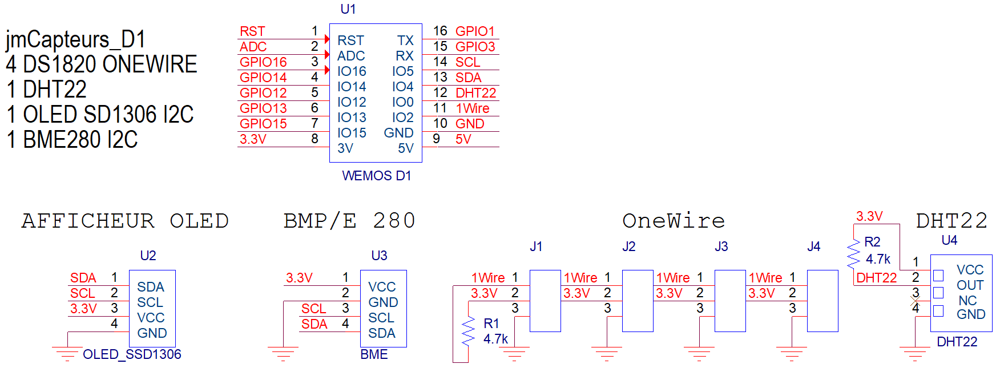
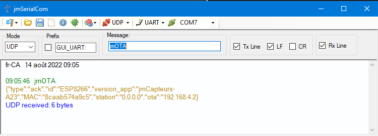
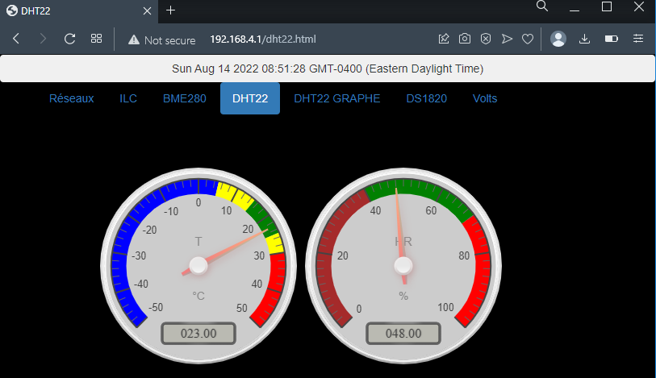
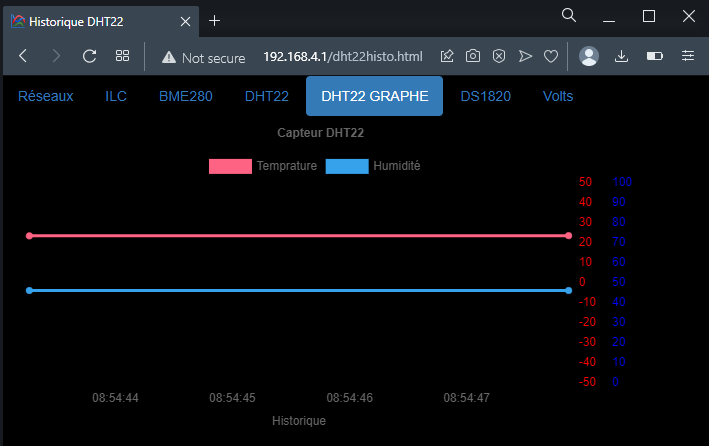
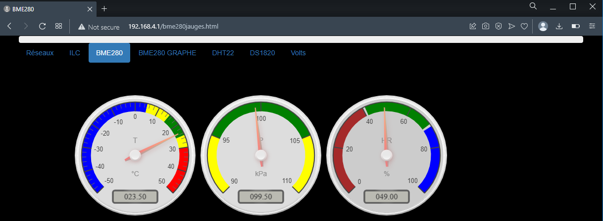
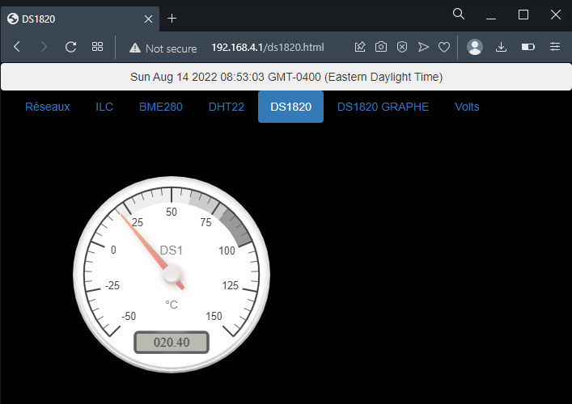
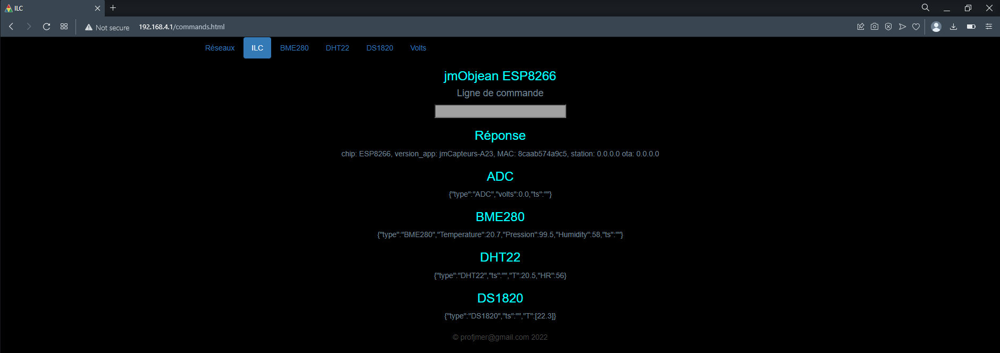
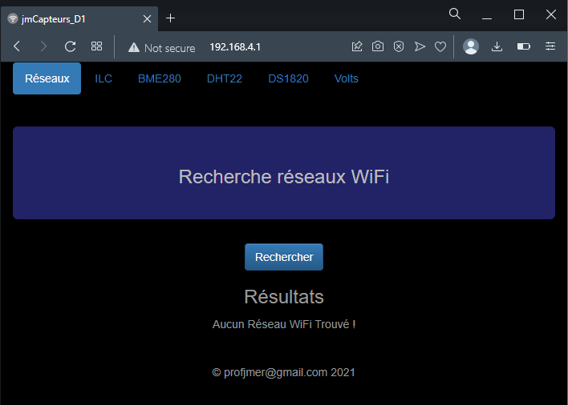

# **jmCapteurs**

jmCapteurs est un petit objet intelligent connecté ayant des capteurs et pouvant publier leurs valeurs de différentes façons.

C'est un module Wemos D1 mini auquel différents capteurs sont reliés. Un afficheur OLED SSD1306 peut également y être raccordé.

L'objet peut fournir son propre point d'accès ou se relier à un réseau.

Par la suite un fureteur permet d'accéder aux visualisations des données des capteurs.

Il suffit d'alimenter l'objet et de se relier à lui.

L'objet est un serveur de visualisation des données de ses capteurs.

L'objet peut publier les valeurs de ses capteurs en MQTT vers io.adafruit.com.

L'objet peut publier les valeurs de ses capteurs par Websocket vers un fureteur.

L'objet peut publier les valeurs de ses capteurs en UDP vers un autre système ordiné.

# ​Requête d'identification des jmCapteurs dans le réseau

La requête udp jmOTA permet d'identifier tous les objets intelligents construit avec le framework jmObjean dans un réseau. (jmDashMin, jmCapteurs, jmObjean_2023 ...)

L'objet écoute sur le port UDP 8266.

Si la commande est broadcastée dans le réseau, alors tous les objets vont s'identifier. (texte en or)

# ​Serveur de visualisation

L'objet connecté contient un serveur WEB et un système de fichiers.

Le système de fichiers contient les pages Webs et les scripts de visualisation.

Lorsqu'une page est consultée, le serveur Web télécharge la page et son script et ouvre un canal de communication bidirectionnel entre l'objet et le fureteur.

Lors de la connexion, le fureteur fait une requête pour obtenir les dernières valeurs des capteurs.

L'objet peut être configuré pour pousser les valeurs de ses capteurs à intervalles régulières vers le fureteur.

L'objet contient également un serveur FTP. Un client FTP peut se connecter (jmer 123) pour modifier le contenu des pages Webs et les scripts. L'objet n'a donc pas à être reprogrammé pour modifier son interface Web.

Voici les capteurs pouvant être reliés à l'objet.

## ​Capteurs

### ​ADC - jauge

### ​ADC - Graphe

### ​DHT22 - Jauges

### ​DHT22 - Graphe

### BME280 - Jauges

### BME280 - ​Graphe 

### ​DS1820 - Jauges

### ​DS1820 - Graphe

## ​Page ILC

C'est la page permettant de lancer des commandes vers l'objet. On y voit les publications des capteurs sous forme texte.

Cette page permet de configurer le fonctionnenement de l'objet.

La commande, menu, affiche tous les modules disponibles dans l'objet.

Le nom d'un module, entré comme commande, affiche les commandes disponibles de ce module.

Les commandes sont également accessibles par le port USB et par le port UDP 8266.

Le fichier config.ini situé dans le système de fichiers permet d'y placer des commandes afin qu'elles soient exécutées lors du démarrage de l'objet.

## ​Page Réseaux

C'est la page qui scrute les réseaux accessibles et qui permet de connecter l'objet à un de ces réseaux.

